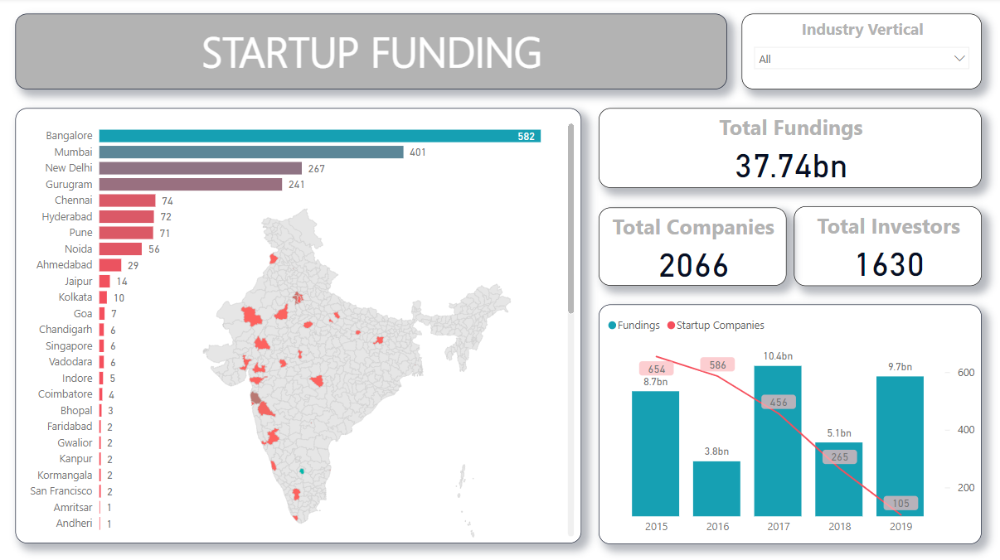
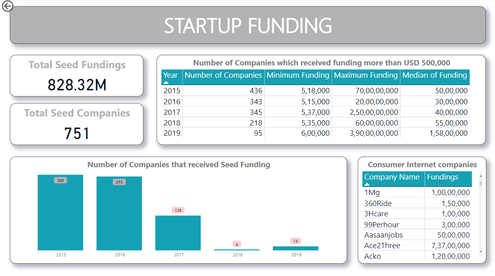

# Dashboard (Power BI)

File: [`Capstone_project.pbix`](Capstone_project.pbix) — 2 pages, built on
top of the Snowflake summary tables in [`../sql/`](../sql/).

## Page 1 — Overview

- KPI cards: **Total Fundings ($37.74bn)**, **Total Companies (2,066)**,
  **Total Investors (1,630)**
- Bar chart + choropleth map of funded companies by city — Bangalore leads
  with 582, followed by Mumbai (401), New Delhi (267), and Gurugram (241)
- Combo chart of yearly total funding vs. number of startup companies
  (2015–2019), showing both funding and deal count declining sharply into
  2019
- Slicer on `Industry Vertical`

## Page 2 — Seed Funding, Big Tickets & Consumer Internet

- KPI cards: **Total Seed Fundings ($828.32M)**, **Total Seed Companies (751)**
- Table: companies funded above USD 500,000 per year, with min / max / median
  funding
- Bar chart: number of companies that received Seed funding per year
  (falls from 300 in 2015 to single digits by 2018–19)
- Table: Consumer Internet companies and their individual funding amounts

## Data source

The dashboard is connected to the Snowflake summary tables described in
[`../sql/README.md`](../sql/README.md). To point it at your own Snowflake
instance: open the file in Power BI Desktop → **Transform Data** → **Data
source settings** → update the connection.
