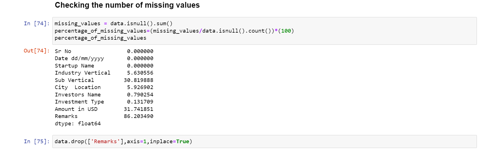
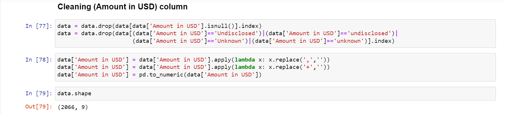
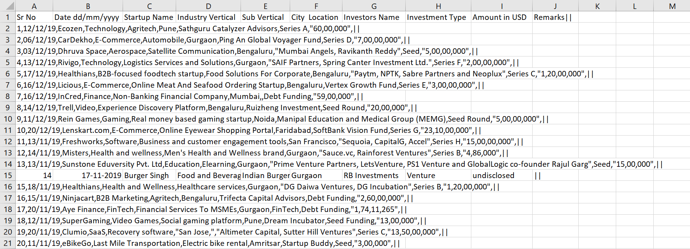
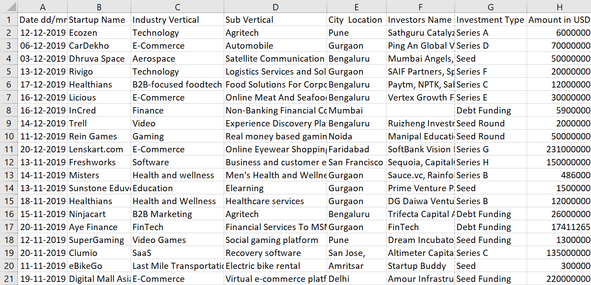

# Data Cleaning

This stage turns the broken raw export into an analysis-ready CSV. It is
split into two parts:

1. **Column recovery & text cleanup** (Stages 1–3) — turning the raw export
   into a proper table and removing unwanted characters. Reproduced in
   [`data_cleaning.py`](data_cleaning.py).
2. **Final pandas cleanup** (Stage 4) — the notebook steps shown in the
   screenshots below, also reproduced in `data_cleaning.py`.

See [`../data/README.md`](../data/README.md) for what each intermediate file
looks like.

## Pipeline

| Stage | Input | Output | What happens |
|---|---|---|---|
| 1–2 | `Start-up_Funding1.csv` | `Start-up_Funding2.csv` | Strip the broken `||`/quote-wrapping export artifact; re-parse each line into the 10 real columns |
| 3 | `Start-up_Funding2.csv` | `Start-Up_Funding.csv` | Remove unwanted characters: internal commas in multi-value fields, spelling inconsistencies (`Ecommerce` → `E-commerce`), encoding artifacts, mixed date separators |
| 4 | `Start-Up_Funding.csv` | `Start-Up_funding_cleaned.csv` | Drop `Remarks` column; drop null/undisclosed Amount rows; strip commas/`+` from Amount and cast to numeric; drop duplicates/empty rows |

## Run it

```bash
cd data_cleaning
python data_cleaning.py --input ../data/raw/Start-up_Funding1.csv --outdir ../data
```

This regenerates all three downstream files from the raw export and prints
the row/column counts at each stage. Running it against the raw file in this
repo reproduces the shipped `Start-Up_funding_cleaned.csv` almost exactly
(2,066 rows × 9 columns, matching row-for-row).

## Stage 4 in detail (with screenshots)

**Checking the number of missing values.** Nulls were audited per column
before deciding what to drop — `Sub Vertical` (~31%) and `Amount in USD`
(~32%) had the most gaps, and `Remarks` was ~86% empty, which is why it was
dropped outright rather than imputed.



**Cleaning the `Amount in USD` column.** Rows with a null, `'Undisclosed'`,
or `'Unknown'` amount were dropped; thousands separators (`,`) and stray
`+` characters were stripped from the remaining values before casting the
column to numeric with `pd.to_numeric`.



**Before / after.** Raw rows (left) vs. the cleaned, numeric-typed table
(right) — final shape `(2066, 9)`.

| Raw preview | Cleaned preview |
|---|---|
|  |  |

## Notes / limitations

- The date-standardization and mojibake-fixing helpers in
  `data_cleaning.py` are regex/heuristic based — good enough to normalize
  the vast majority of rows, but a handful of edge cases (unusual date
  typos, rare encoding artifacts) may need a manual look if you re-run this
  against a different export.
- No duplicate rows actually existed in this dataset once the Amount-based
  filtering was applied — the `drop_duplicates()` step is included because
  it's good practice, but the row-count drop (3,037 → 2,066) is fully
  explained by the null/undisclosed Amount filter.
